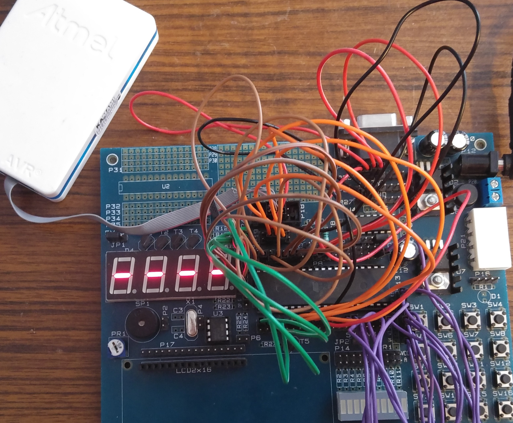
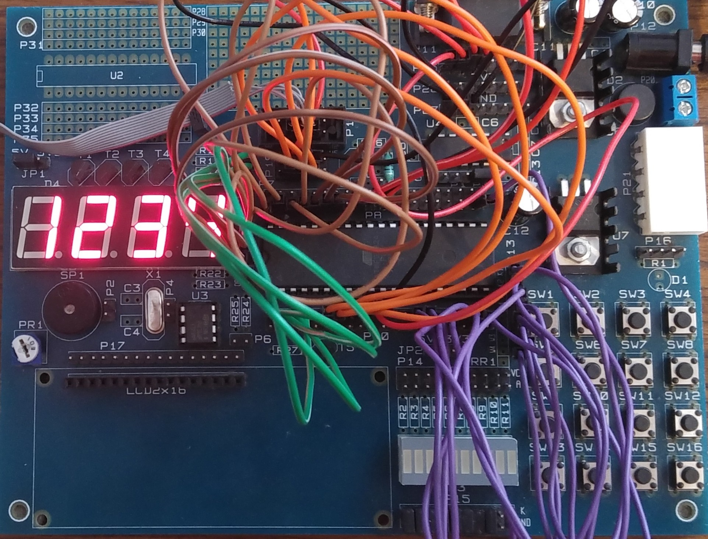
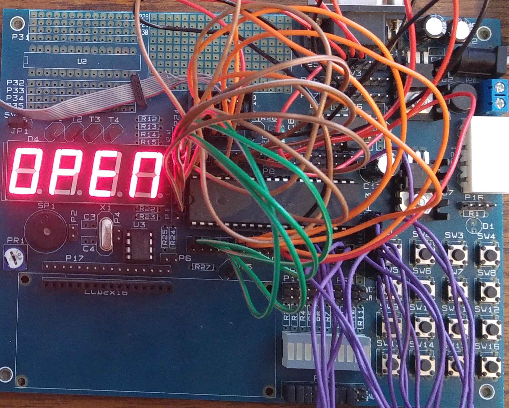
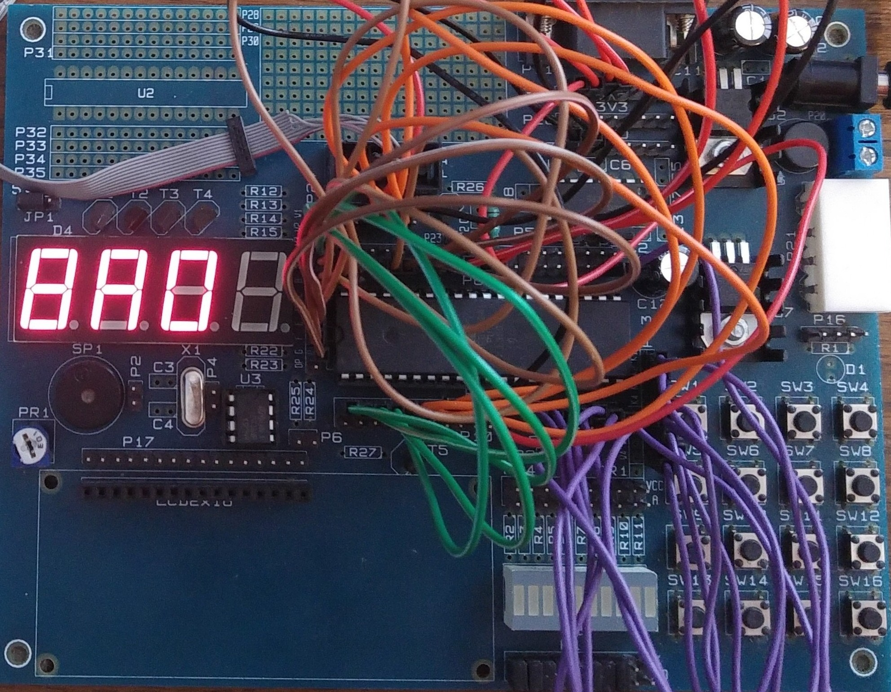

# Keypad_Lock_ATMega32A

Embedded C++ implementation of Keypad Lock created in Atmel Studio IDE supporting 16-buttons 4x4 keypad (only 12 buttons used) and 4 digit 7-segment common anode display. Target microcontroller is ATMEGA32A.

# Pinout
- **PORTA** - drives segments of the 7-segment display (PA0 -> segment A, PA1 -> segment B etc.)

- **PORTB** - drives digits of the 7-segment display   (PB0 -> row 1, PB1 -> row 2 etc.)

- **PORTC** - unused

- **PORTD** - connected to keypad rows and columns (PD 0-3 configured as output pins and connected to rows, PD 4-7 configured as input pins and connected to columns)

# Flashing
Flash ATMEGA32A microcontroller using **flash.elf**

# How to use:
1. Power-up ATMega32A, the display should show 4 hyphens "-".

2. Enter your 4-digit code and press OK - button 12, in case of mistyped number press ERASE_DIGIT button - button 11. It will erase last entered digit.

3. Program is now in lock state marked by displaying 4 H letters on each digit of 7-segment display.

4. Enter proper 4-digit code and press OK - button 12, in case of mistyped number press ERASE_DIGIT button - button 11. It will erase last entered digit.

5. If you succeed the display shows "OPEn" for about 2 seconds. The keypad lock is then open and program restars enabling user to set another password again. 

6. Otherwise, the display shows "bAd" for about 2 seconds, afterwards you can try again.

